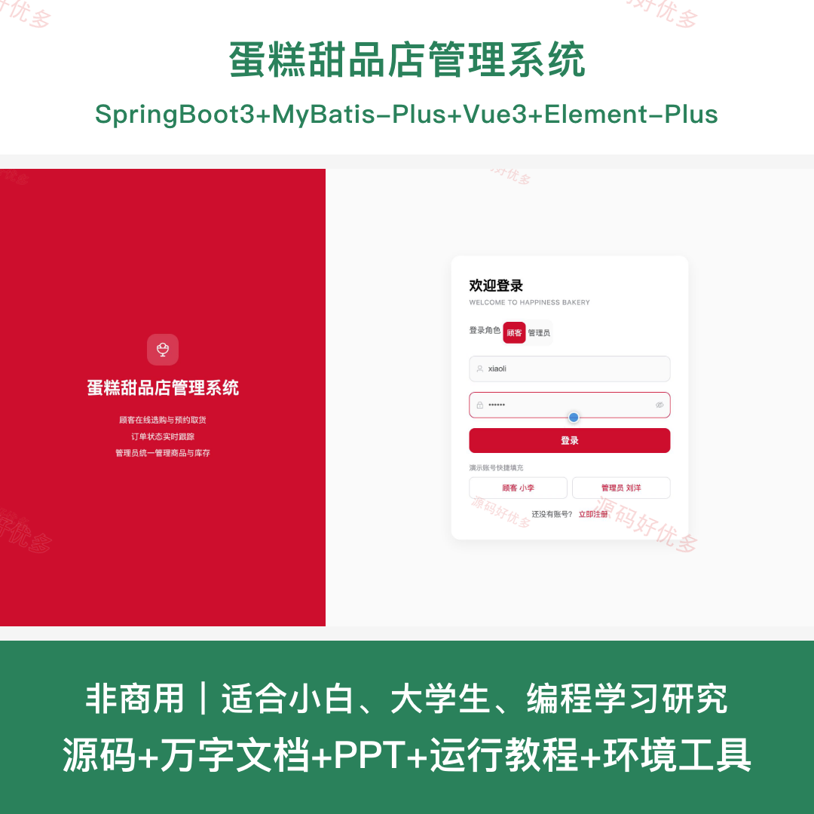
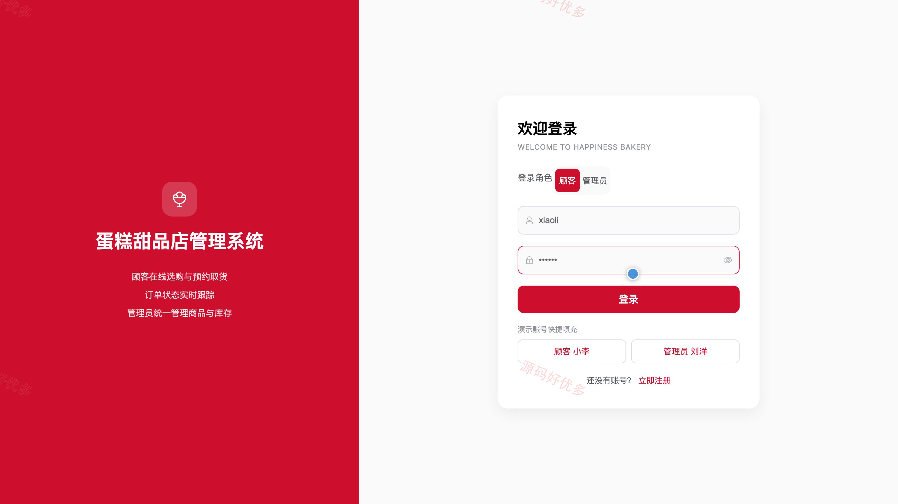
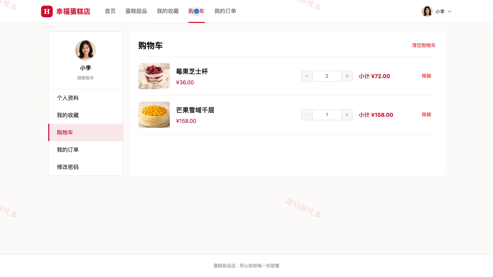
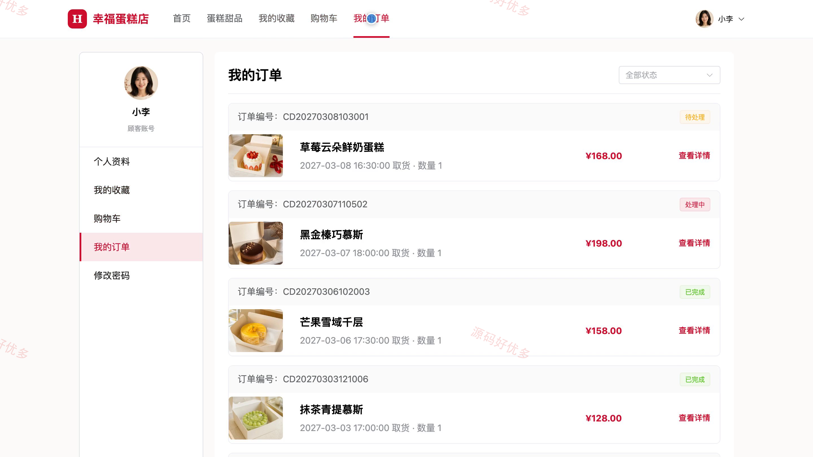
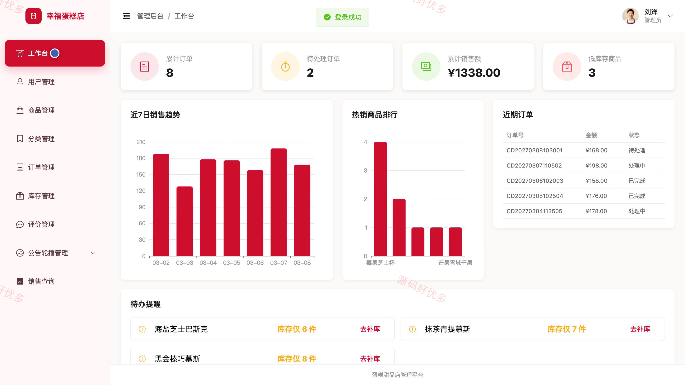
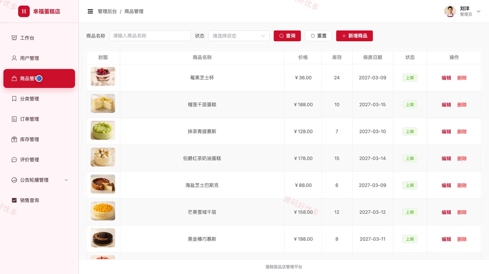
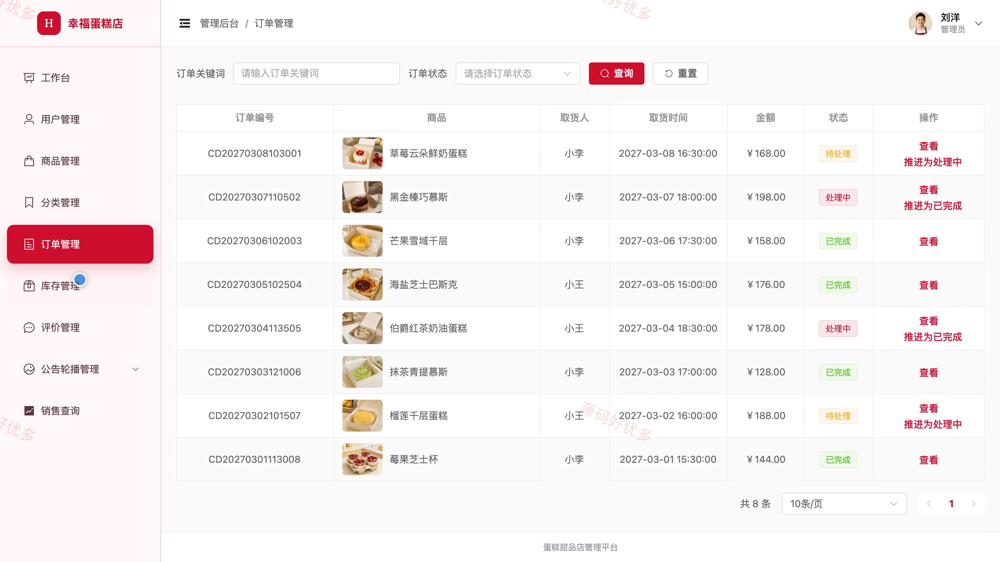

## 源码问题查看主页咨询

### 一、关键词
蛋糕店管理、甜品商城、烘焙订购、蛋糕预订、门店订单管理

### 二、作品包含
源码+数据库+万字设计文档+PPT+全套环境和工具资源+本地部署教程

### 三、项目技术
前端技术： Html、Css、Js、Vue3.4、Element-Plus
后端技术：Java、SpringBoot3.2.0、MyBatis-Plus

### 四、运行环境（以下版本亲测，其他版本兼容性请自行测试）
开发工具：IDEA/eclipse + VSCODE

数据库：MySQL5.7+（共13张表）

数据库管理工具：Navicat10以上版本

环境配置软件： JDK17 + Maven

前端Nodejs：16+

浏览器：谷歌浏览器

### 五、项目介绍
项目编号：bs107A

蛋糕甜品店管理系统面向顾客与管理员，围绕蛋糕甜品浏览、购物车、在线下单、订单履约、库存预警、评价反馈和门店经营统计形成完整业务闭环。顾客可完成商品选购与个人订单管理，管理员可维护商品、订单、库存、内容和经营数据。

角色：顾客、管理员

顾客功能：账号注册与登录、蛋糕甜品浏览与搜索、商品浏览与互动、购物车管理、在线下单、订单查询与取消、个人资料与密码维护。

管理员功能：工作台与经营统计、顾客账号管理、蛋糕甜品与分类管理、订单状态管理、库存预警与调整、商品评价与商家回复、公告轮播管理、销售明细查询。

### 六、运行截图

